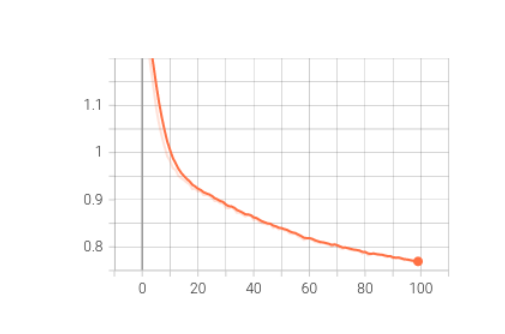

<!-- #region -->
# Recommendation_system


## Content based filtering

A toy algorithm was implemented for content based filtering just to showcase the principle on which content based filtering works on. 

The algoithm:
<ol>
  <li>Ask user to rate 3 random movies from the whole dataset</li>
  <li>Assign weight to each genre based on the movie ratings given by the user</li>
  <li>Based on weightage of genres sample movies from the movie dataset </li>
</ol> 


## Colaborative based filtering

### Matrix factorization model

The input data is split into Train and Test data. Train data is given input to the Matrix Factorisation technique in which SVD ++ Algorithm is used, ratings are computed corresponding to the test data using the ratings of the trained data. From the algorithm we get complete user-item matrix of the data, and rmse value of the ratings for the test data is computed which is around 1.18. 


### Neural collaborative model

The model was proposed in the paper 
```
He, Xiangnan, et al. "Neural collaborative filtering." Proceedings of the 26th international conference on world wide web. 2017.
```

#### Architecture


The proposed architecture has two branches, the branches’ outputs are concatenated and sent through an MLP layer. One of the branches generalises the MF model, and the other branch models the complex user-item function through MLP layers. The embeddings used in both these branches are different to allow more flexibility.

#### Training curves

<center>Train loss</center>


<center>Validation loss</center>


## Results

RMSE of matrix factorisation model: 1.18

RMSE of neural collaborative filtering model: 0.84
<!-- #endregion -->

```python

```
